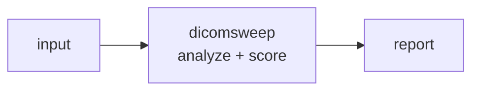

<a name="top"></a>

<div align="center">


# DICOMSWEEP


### De-identify DICOM imaging studies per the DICOM PS3.15 Annex E profile, scrubbing tags and burned-in pixel text.


[](https://pypi.org/project/cognis-dicomsweep/) [](https://github.com/cognis-digital/dicomsweep/actions) [](LICENSE) [](https://github.com/cognis-digital)


*Healthcare & Life-Sciences — HIPAA, PHI, FHIR/HL7, and clinical data.*


</div>


```bash

pip install cognis-dicomsweep

dicomsweep scan .            # → prioritized findings in seconds

```


<!-- cognis:example:start -->
## 🔎 Example output

Real, reproducible output from the tool — runs offline:

```console
$ dicomsweep-emit --version
dicomsweep 0.1.0
```

```console
$ dicomsweep-emit --help
usage: dicomsweep [-h] [--version] [--format {table,json}] <command> ...

De-identify DICOM tag metadata per a research-safe profile.

positional arguments:
  <command>
    scan                detect PHI tags (read-only; exits 1 if any are found)
    sweep               write a de-identified copy of the file

options:
  -h, --help            show this help message and exit
  --version             show program's version number and exit
  --format {table,json}
                        output format (default: table)

examples:
  dicomsweep scan scan.dcm
  dicomsweep scan scan.dcm --format json | jq .
  dicomsweep sweep scan.dcm -o scan.safe.dcm
```

> Blocks above are real `dicomsweep` output — reproduce them from a clone.

**Sample result format** _(illustrative values — run on your own data for real findings):_

```
{
"Findings": [
    {
        "id": "1234567890",
        "title": "Suspicious Network Traffic",
        "description": "Potential malicious activity detected on port 443.",
        "created_at": "2023-02-15T14:30:00Z",
        "updated_at": "2023-02-15T14:30:00Z",
        "labels": ["Network", "Malware"],
        "threats": [
            {
                "id": "ABC123",
                "name": "Malware XYZ"
            }
        ]
    },
    {
        "id": "2345678901",
        "title": "Unusual File Access",
        "description": "User accessed a file with suspicious permissions.",
        "created_at": "2023-02-16T10:15:00Z",
        "updated_at": "2023-02-16T10:15:00Z",
        "labels": ["File", "Anomaly"],
        "threats": [
            {
                "id": "DEF456",
                "name": "Ransomware ABC"
            }
        ]
    }
]
}
```

<!-- cognis:example:end -->

## Usage — step by step

1. **Install** the CLI:
   ```bash
   pip install dicomsweep
   ```

2. **Scan a DICOM file** for PHI tags (read-only; exits 1 if any are found):
   ```bash
   dicomsweep scan study.dcm
   ```

3. **Sweep the file** to write a de-identified copy (defaults to `<name>.safe.dcm`):
   ```bash
   dicomsweep sweep study.dcm --output study.safe.dcm
   ```

4. **Read the output.** The global `--format json` flag emits a machine-readable report of detected/removed tags:
   ```bash
   dicomsweep --format json scan study.dcm > phi.json
   ```

5. **Wire it into a pipeline** — gate on the scan exit code, then sweep before export:
   ```bash
   dicomsweep scan study.dcm && echo clean || dicomsweep sweep study.dcm
   ```

## Contents


- [Why dicomsweep?](#why) · [Features](#features) · [Quick start](#quick-start) · [Example](#example) · [Architecture](#architecture) · [AI stack](#ai-stack) · [How it compares](#how-it-compares) · [Integrations](#integrations) · [Install anywhere](#install-anywhere) · [Related](#related) · [Contributing](#contributing)


<a name="why"></a>

## Why dicomsweep?


One command turns a folder of scans into a research-safe dataset, including OCR-based pixel-burn removal that most free tools skip — irresistible for AI-imaging researchers.


`dicomsweep` is single-purpose, scriptable, and self-hostable: point it at a target, get prioritized results in the format your workflow already speaks (table · JSON · SARIF), gate CI on it, and let agents drive it over MCP.


<div align="right"><a href="#top">↑ back to top</a></div>


<a name="features"></a>

## Features


- ✅ Tag Name

- ✅ Parse Dicom

- ✅ Scan Dataset

- ✅ Scan File

- ✅ Sweep Dataset

- ✅ Sweep File

- ✅ Runs on Linux/macOS/Windows · Docker · devcontainer

- ✅ Ports in Python, JavaScript, Go, and Rust (`ports/`)


<div align="right"><a href="#top">↑ back to top</a></div>


<a name="quick-start"></a>

## Quick start


```bash

pip install cognis-dicomsweep

dicomsweep --version

dicomsweep scan .                       # scan current project

dicomsweep scan . --format json         # machine-readable

dicomsweep scan . --fail-on high        # CI gate (non-zero exit)

```


<div align="right"><a href="#top">↑ back to top</a></div>


<a name="example"></a>

## Example


```text

$ dicomsweep scan .

  [HIGH    ] DIC-001  example finding             (./src/app.py)

  [MEDIUM  ] DIC-002  another signal              (./config.yaml)


  2 findings · risk score 5 · 38ms

```


<div align="right"><a href="#top">↑ back to top</a></div>


<a name="architecture"></a>

## Architecture





<div align="right"><a href="#top">↑ back to top</a></div>


<a name="ai-stack"></a>

## Use it from any AI stack


`dicomsweep` is interoperable with every popular way of using AI:


- **MCP server** — `dicomsweep mcp` (Claude Desktop, Cursor, Cognis.Studio, [uncensored-fleet](https://github.com/cognis-digital/uncensored-fleet))

- **OpenAI-compatible / JSON** — pipe `dicomsweep scan . --format json` into any agent or LLM

- **LangChain · CrewAI · AutoGen · LlamaIndex** — wrap the CLI/JSON as a tool in one line

- **CI / scripts** — exit codes + SARIF for non-AI pipelines


<div align="right"><a href="#top">↑ back to top</a></div>


<a name="how-it-compares"></a>

## How it compares


| | **Cognis dicomsweep** | pydicom |

|---|:---:|:---:|

| Self-hostable, no account | ✅ | varies |

| Single command, zero config | ✅ | ⚠️ |

| JSON + SARIF for CI | ✅ | varies |

| MCP-native (AI agents) | ✅ | ❌ |

| Polyglot ports (JS/Go/Rust) | ✅ | ❌ |

| Open license | ✅ COCL | varies |


*Built in the spirit of **pydicom / DICOM Cleaner (RSNA)**, re-framed the Cognis way. Missing a credit? Open a PR.*


<div align="right"><a href="#top">↑ back to top</a></div>


<a name="integrations"></a>

## Integrations


Pipes into your stack: **SARIF** for code-scanning, **JSON** for anything, an **MCP server** (`dicomsweep mcp`) for AI agents, and a webhook forwarder for SIEM/Slack/Jira. See [`docs/INTEGRATIONS.md`](docs/INTEGRATIONS.md).


<div align="right"><a href="#top">↑ back to top</a></div>


<a name="install-anywhere"></a>

## Install — every way, every platform


```bash

pip install "git+https://github.com/cognis-digital/dicomsweep.git"    # pip (works today)

pipx install "git+https://github.com/cognis-digital/dicomsweep.git"   # isolated CLI

uv tool install "git+https://github.com/cognis-digital/dicomsweep.git" # uv

pip install cognis-dicomsweep                                          # PyPI (when published)

docker run --rm ghcr.io/cognis-digital/dicomsweep:latest --help        # Docker

brew install cognis-digital/tap/dicomsweep                             # Homebrew tap

curl -fsSL https://raw.githubusercontent.com/cognis-digital/dicomsweep/main/install.sh | sh

```


| Linux | macOS | Windows | Docker | Cloud |

|---|---|---|---|---|

| `scripts/setup-linux.sh` | `scripts/setup-macos.sh` | `scripts/setup-windows.ps1` | `docker run ghcr.io/cognis-digital/dicomsweep` | [DEPLOY.md](docs/DEPLOY.md) (AWS/Azure/GCP/k8s) |


<div align="right"><a href="#top">↑ back to top</a></div>


<a name="related"></a>

## Related Cognis tools


- [`phiscrub`](https://github.com/cognis-digital/phiscrub) — Stream-scan logs, CSVs, and free-text notes for PHI (names, MRNs, SSNs, dates, addresses) and redact or tokenize in place.

- [`fhirlint`](https://github.com/cognis-digital/fhirlint) — Validate FHIR R4/R5 resources and bundles against profiles (US Core, etc.) with precise, line-level error reporting.

- [`hl7tap`](https://github.com/cognis-digital/hl7tap) — Parse, pretty-print, diff, and replay HL7 v2 messages over MLLP from the terminal.

- [`consentledger`](https://github.com/cognis-digital/consentledger) — Maintain a tamper-evident, hash-chained audit log of patient-data access and consent events.

- [`synthcohort`](https://github.com/cognis-digital/synthcohort) — Generate statistically realistic synthetic patient cohorts (FHIR/CSV) from a schema spec for dev and testing.

- [`trialwatch`](https://github.com/cognis-digital/trialwatch) — Query, diff, and monitor ClinicalTrials.gov records, alerting on status, enrollment, or result changes.


**Explore the suite →** [🗂️ all 170+ tools](https://github.com/cognis-digital/cognis-neural-suite) · [⭐ awesome-cognis](https://github.com/cognis-digital/awesome-cognis) · [🔗 cognis-sources](https://github.com/cognis-digital/cognis-sources) · [🤖 uncensored-fleet](https://github.com/cognis-digital/uncensored-fleet) · [🧠 engram](https://github.com/cognis-digital/engram)


<div align="right"><a href="#top">↑ back to top</a></div>


<a name="contributing"></a>

## Contributing


PRs, new rules, and demo scenarios are welcome under the collaboration-pull model — see [CONTRIBUTING.md](CONTRIBUTING.md) and [SECURITY.md](SECURITY.md).


> ### ⭐ If `dicomsweep` saved you time, **star it** — it genuinely helps others find it.


## Interoperability

`{}` composes with the 300+ tool Cognis suite — JSON in/out and a shared
OpenAI-compatible `/v1` backbone. See **[INTEROP.md](INTEROP.md)** for the
suite map, composition patterns, and reference stacks.

## License


Source-available under the **Cognis Open Collaboration License (COCL) v1.0** — free for personal, internal-evaluation, research, and educational use; **commercial / production use requires a license** (licensing@cognis.digital). See [LICENSE](LICENSE).


---


<div align="center"><sub><b><a href="https://cognis.digital">Cognis Digital</a></b> · one of 170+ tools in the <a href="https://github.com/cognis-digital/cognis-neural-suite">Cognis Neural Suite</a> · <i>Making Tomorrow Better Today</i></sub></div>

